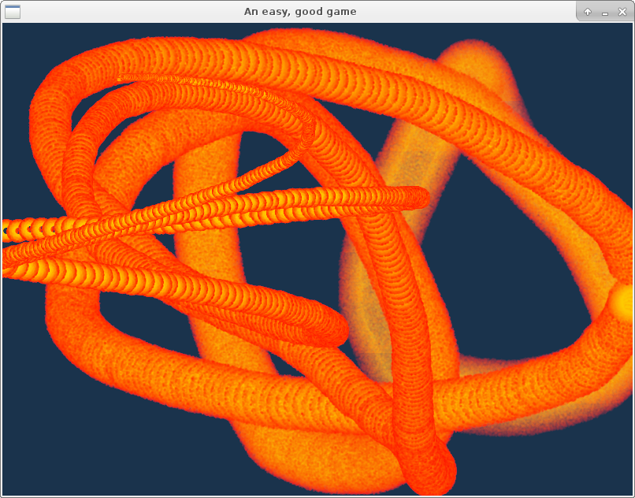

# Particle Frenzy
A simple 2D particle system in Rust using [gfx](https://github.com/gfx-rs/gfx). Particles are created with some initial state and then handed over to the GPU.

- Advantage: Particle movement is performed on the GPU, so buffers don't need to be modified for updating the particle state.
- Disadvantage: Dynamic particle state needs to be parameterized by time.

Parts of the code, especially the shaders, are based on gfx's [particle example](https://github.com/gfx-rs/gfx/tree/v0.17/examples/particle).

## Status
Consider this a proof of concept. Currently, only circular particles are possible.

## Example
See [examples/ggez.rs](examples/ggez.rs) for an example of using this crate in combination with `ggez`:
```text
cargo run -j4 --release --example ggez
```
In this example, 2000 particles are spawned whenever the mouse is moved.


